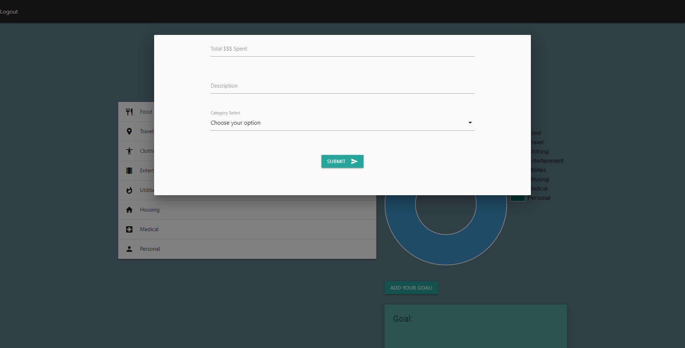
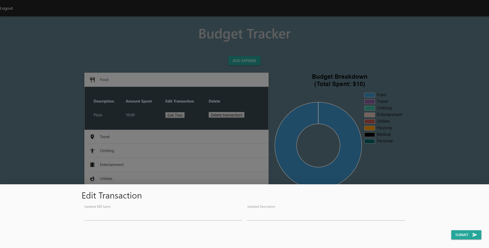
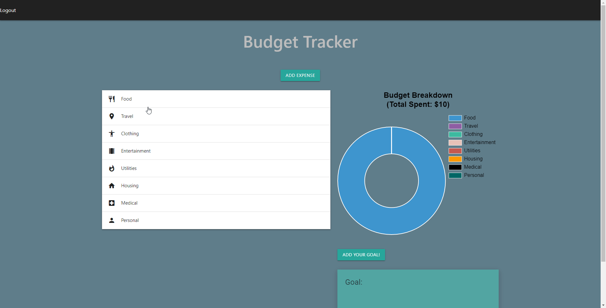

# Budget Tracker

## **[Link to live site](https://safe-depths-87257.herokuapp.com/)**

#### Prerequisites

* Just sign up!
* Or if you don't want to sign up, use one of our demo accounts. They might be prefilled with previous data though. Not to worry! You can delete the old data if you choose to!

```
* email: test@test.com || password: test 
* email: demo@demo.com || password: demo
```


### Introduction

With this app you can do a few things. Our project is a budget tracker. With our budget tracker, we present a doughnut chart, similar to what you may see from your credit card statements. It will show you how much you spent in each category, and your total spent. The difference is, you enter how much you spent, so be honest!

For example:
```
* Submit new trasaction
* Edit transactions
* Delete transactions
* Add a goal
```

 The rest is done for you! You don't have to manually add your totals, and you'll be given a visual of how much you're spending in each category.

## Using the app

In order for you to use the app, you have to signup to access your personal tracker. Once logged in, your presented with a blank slate page where you can start inputting your spending.

### Functions

1. Submitting new transactions

When you submit a new transaction, the amount spent will automatically be added into the doughnut chart. It will also be added into a table within the appropriate category where you can view your spending history.



2. Edit a transaction

To edit your data, you simply go to the category of the transaction you want to edit. Once you click the category, hit the edit button. When you edit a transaction, it will adjust the doughnut chart to increment, or decrement, the difference between the two amounts as well as the table holding this data.



3. Deleting a transaction

If you just don't want this transaction anymore, just go to the same location as you did for edit, except hit the delete button right next to it. It will be removed from your history never to be seen again.




4. Adding a goal

Just like you did for adding a new transaction, you can also add a goal. Just click the add your goal button instead! Once you click the add your goal button, just put what you're goal item is into the goal input row, and how much you think it'll directly below it.


## Technologies 

* MySQL Workbench
* Node.js
* Passport
* bcryptjs
* Express
* Materialize
* Sequelize

## Future Developments
In the future we would like to implement a monthly goal, and compare spending habits against all users. We can also improve on our styles, and responsiveness of our website. If users forget their password, they can't actually reset their password, at the moment. Adding a "Forgot Password" feature would be helpful in this situation. Lastly, we'd like to use an Api to dynamically create columns tailored to each user.

## Authors
Orlando Corona, James Grodzicki, Zaya Zaw

#### Credits
Thanks to José Rosário for the blueprint of the interactive login screen!
